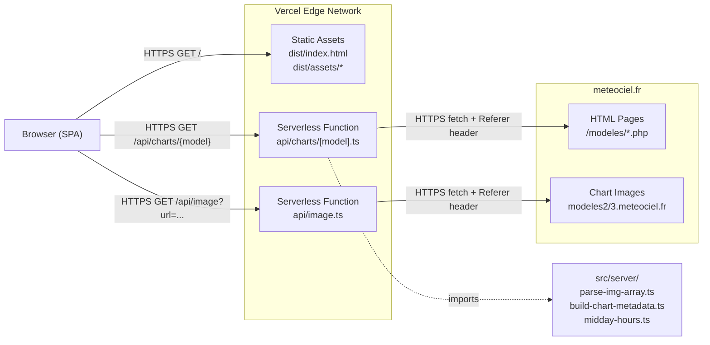
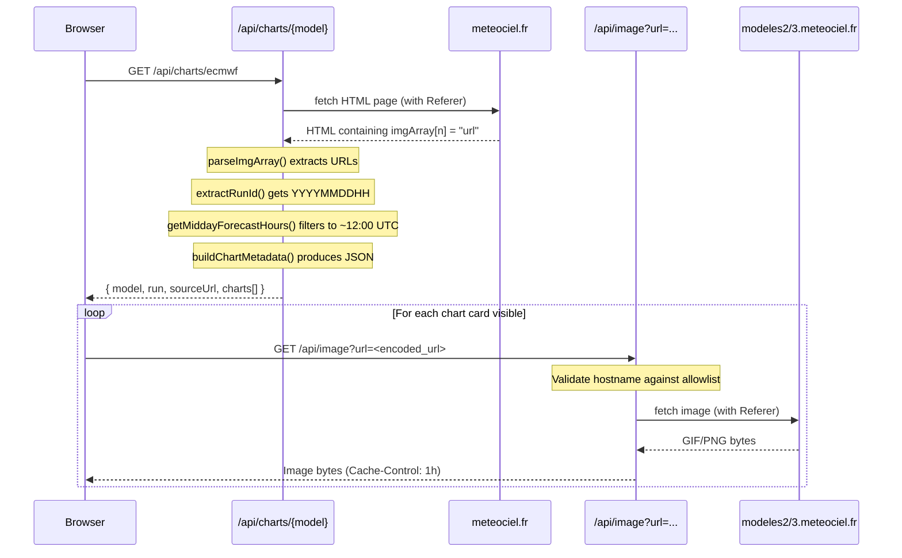
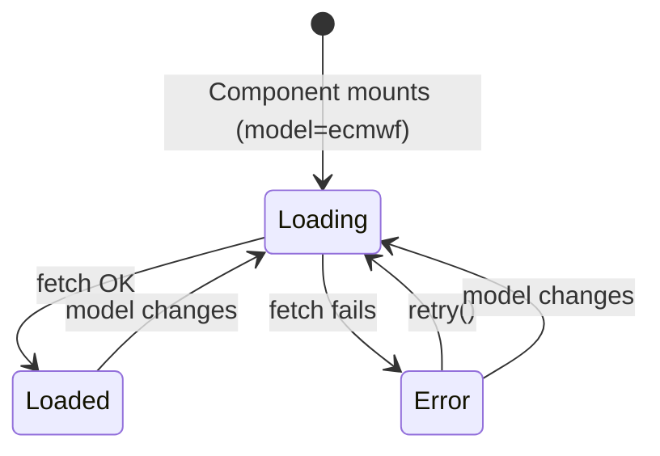

# Technology Reference

## 1. Tech Stack

| Layer | Technology | Version | Purpose |
|-------|-----------|---------|---------|
| Language | TypeScript | ~5.9.3 | Static typing across frontend and server code |
| Runtime | Node.js | >=18 (Vercel) | Serverless function runtime |
| UI Library | React | ^19.2.0 | Component-based frontend |
| UI DOM | ReactDOM | ^19.2.0 | React DOM renderer |
| Build Tool | Vite | ^7.3.1 | Dev server, HMR, production bundler |
| CSS | Tailwind CSS | ^4.2.1 | Utility-first styling (v4 Vite plugin) |
| Testing | Vitest | ^4.0.18 | Unit test runner (Vite-native) |
| Linting | ESLint | ^9.39.1 | Code quality (flat config) |
| Hosting | Vercel | Serverless | Static site + serverless API functions |
| Serverless Types | @vercel/node | ^5.6.9 | `VercelRequest`/`VercelResponse` types |

Supporting packages:

| Package | Version | Purpose |
|---------|---------|---------|
| @vitejs/plugin-react | ^5.1.1 | React Fast Refresh for Vite |
| @tailwindcss/vite | ^4.2.1 | Tailwind CSS v4 Vite integration |
| typescript-eslint | ^8.48.0 | TypeScript ESLint rules |
| eslint-plugin-react-hooks | ^7.0.1 | Rules of Hooks enforcement |
| eslint-plugin-react-refresh | ^0.4.24 | Validates Fast Refresh boundaries |
| globals | ^16.5.0 | Browser/Node global definitions for ESLint |
| @types/node | ^24.10.1 | Node.js type definitions |
| @types/react | ^19.2.7 | React type definitions |
| @types/react-dom | ^19.2.3 | ReactDOM type definitions |

---

## 2. Architecture Diagram



**Local dev** replaces the two serverless functions with a single Vite plugin (`src/server/vite-plugin-api.ts`) that intercepts `/api/*` requests in the dev server middleware. The frontend code is identical in both environments since it uses relative `/api/...` URLs.

---

## 3. Data Flow

### Primary workflow: loading forecast charts



### Parsing algorithm: `parseImgArray`

Meteociel pages embed forecast image URLs in inline JavaScript:

```
// Input: raw HTML from meteociel.fr
<script>
var imgArray = new Array();
imgArray[0] = "https://modeles2.meteociel.fr/.../runs/2026022600/3-778.GIF?26-6";
imgArray[1] = "https://modeles2.meteociel.fr/.../runs/2026022600/6-778.GIF?26-6";
imgArray[2] = "https://modeles2.meteociel.fr/.../runs/2026022600/12-778.GIF?26-6";
</script>

// Output: string[]
[
  "https://modeles2.meteociel.fr/.../runs/2026022600/3-778.GIF?26-6",
  "https://modeles2.meteociel.fr/.../runs/2026022600/6-778.GIF?26-6",
  "https://modeles2.meteociel.fr/.../runs/2026022600/12-778.GIF?26-6"
]
```

Regex: `/imgArray\[\d+\]\s*=\s*"([^"]+)"/g`

### Midday filtering algorithm: `getMiddayForecastHours`

Given a model's run hour (e.g. 00Z, 06Z, 12Z, 18Z), compute which forecast-hour offsets land on 12:00 UTC:

```
Input:  model=gfs, runHourUtc=0
Logic:  firstMiddayOffset = (12 - 0 + 24) % 24 = 12
        step every 24h up to MAX_HOURS[gfs]=240
Output: [12, 36, 60, 84, 108, 132, 156, 180, 204, 228]

Input:  model=ecmwf, runHourUtc=12
Logic:  firstMiddayOffset = (12 - 12 + 24) % 24 = 0
        step every 24h up to MAX_HOURS[ecmwf]=360
Output: [0, 24, 48, 72, ..., 336, 360]
```

### Forecast hour extraction from URLs

Different URL patterns per model:

| Model | Pattern | Example | Extracted hour |
|-------|---------|---------|---------------|
| GFS | `/(\d+)-\d+\.GIF` | `/12-778.GIF` | 12 |
| ECMWF HRES | `ecmwffr-\d+-(\d+)\.png` | `ecmwffr-30-12.png` | 12 |
| ECMWF legacy | `ECM\d+-(\d+)\.GIF` | `ECM1-24.GIF` | 24 |

---

## 4. Server Architecture

### Process model

- **Local dev:** Single-process Vite dev server. The custom `apiPlugin()` adds Connect middleware that intercepts `/api/*` before Vite's static/HMR handling. All requests are async `fetch()` calls — no threading or workers.
- **Production:** Vercel serverless functions. Each request to `/api/charts/[model]` or `/api/image` spins up an isolated Node.js instance. No shared state between invocations.

### API endpoints

| Method | Path | Purpose | Cache |
|--------|------|---------|-------|
| GET | `/api/charts/{model}` | Scrape meteociel.fr page for `{gfs\|ecmwf}`, parse image URLs, filter to midday hours, return JSON metadata | `public, max-age=1800` (30 min) |
| GET | `/api/image?url={encoded_url}` | SSRF-protected reverse proxy for chart images. Validates hostname against allowlist, forwards with Referer header | `public, max-age=3600` (1 hr) |

### SSRF protection

The image proxy validates URLs against a strict allowlist before proxying:

```
Allowed hosts: www.meteociel.fr, modeles2.meteociel.fr, modeles3.meteociel.fr, meteociel.fr
Required protocol: https:
```

Any URL not matching both conditions returns `403 Forbidden`.

---

## 5. State Management

The app has minimal state — a single model selector and per-fetch loading states.



`useCharts` hook state machine:

| State | `loading` | `error` | `data` |
|-------|-----------|---------|--------|
| Loading | `true` | `null` | previous or `null` |
| Loaded | `false` | `null` | `ChartData` |
| Error | `false` | error message | `null` |

Transitions:
- **model changes** or **retry()** -> resets to Loading (increments internal `retryCount` or updates `fetchKey`)
- **fetch succeeds** -> Loaded
- **fetch fails** -> Error

Lightbox state is a separate `useState<string | null>` in `ChartGrid` — `null` means closed, a URL string means open.

---

## 6. Frontend Architecture

### Component tree

```
App                              Model state (ecmwf | gfs)
  +-- ModelSelector              Two toggle buttons
  +-- ChartGrid                  Data fetching, loading/error/empty states, lightbox state
        +-- ChartCard[]          One per midday forecast (date, hour, image, timezone)
        +-- Lightbox?            Full-screen image overlay (conditional)
```

### Hooks

| Hook | File | Purpose |
|------|------|---------|
| `useCharts(model)` | `src/hooks/useCharts.ts` | Fetches `/api/charts/{model}`, returns `{ data, loading, error, retry }` |

### Notable patterns

- **Cancellation guard:** `useCharts` sets a `cancelled` flag in the `useEffect` cleanup to prevent state updates on stale responses after model switches.
- **Lazy image loading:** `ChartCard` uses `loading="lazy"` on `` elements so off-screen cards don't trigger image proxy requests.
- **Image cropping:** Charts are displayed at 250% size with `object-position: 52% 15%` to zoom into the relevant map region (Belgium/France area).
- **Brussels timezone:** `ChartCard` converts UTC forecast times to CET/CEST using a manual DST calculation (`isCEST()` checks last Sunday of March/October).
- **Weekend highlighting:** Cards for Saturday/Sunday get a green border (`border-green-400`).
- **Responsive grid:** `grid-cols-1 sm:grid-cols-2 lg:grid-cols-3 xl:grid-cols-4`.

---

## 7. File Structure

```
weather-app/
+-- api/                              # Vercel serverless functions (production API)
|   +-- charts/
|   |   +-- [model].ts                # GET /api/charts/{gfs|ecmwf} — scrape + parse + filter
|   +-- image.ts                      # GET /api/image?url=... — SSRF-safe image proxy
+-- src/
|   +-- App.tsx                       # Root component, model state
|   +-- main.tsx                      # React DOM entry point
|   +-- index.css                     # Tailwind v4 import
|   +-- components/
|   |   +-- ModelSelector.tsx         # ECMWF/GFS toggle buttons
|   |   +-- ChartGrid.tsx            # Responsive grid, data fetching, lightbox state
|   |   +-- ChartCard.tsx            # Single forecast card, timezone conversion, image crop
|   |   +-- Lightbox.tsx             # Full-screen image overlay, Escape to close
|   +-- hooks/
|   |   +-- useCharts.ts             # Fetch hook with loading/error/retry
|   +-- server/                       # Shared server utilities (used by both dev + prod)
|       +-- parse-img-array.ts        # Regex parser for meteociel imgArray HTML
|       +-- parse-img-array.test.ts   # 3 tests
|       +-- midday-hours.ts           # Calculate midday forecast hour offsets
|       +-- midday-hours.test.ts      # 6 tests
|       +-- build-chart-metadata.ts   # Combine parsing + filtering into JSON response
|       +-- build-chart-metadata.test.ts  # 3 tests
|       +-- vite-plugin-api.ts        # Vite dev middleware — local-only API
+-- docs/
|   +-- plans/
|   |   +-- 2026-02-26-weather-dashboard-plan.md    # Implementation plan
|   |   +-- 2026-02-26-weather-dashboard-design.md  # Architecture design doc
|   +-- TECHNOLOGY.md                 # This file
+-- index.html                        # HTML shell, mounts #root
+-- package.json                      # Dependencies and npm scripts
+-- vite.config.ts                    # Vite + React + Tailwind + apiPlugin
+-- vercel.json                       # Vercel framework config
+-- tsconfig.json                     # Root TS config (project references)
+-- tsconfig.app.json                 # Frontend TS config (src/, react-jsx)
+-- tsconfig.node.json                # Build tools TS config (vite.config.ts)
+-- tsconfig.api.json                 # Serverless functions TS config (api/)
+-- eslint.config.js                  # ESLint flat config
+-- start-weather-app.bat             # Windows shortcut to start dev server
+-- .gitignore
```

---

## 8. Testing

| Framework | Vitest ^4.0.18 |
|-----------|---------------|
| Environment | `node` (configured in `vite.config.ts`) |
| Run command | `npm test` (`vitest run`) |
| Test files | Co-located with source: `src/server/*.test.ts` |
| Total tests | 12 across 3 files |

| File | Tests | What's tested |
|------|-------|--------------|
| `parse-img-array.test.ts` | 3 | ECMWF relative URLs, GFS absolute URLs, empty HTML |
| `midday-hours.test.ts` | 6 | GFS 00Z/06Z/12Z/18Z runs, ECMWF 00Z/12Z runs |
| `build-chart-metadata.test.ts` | 3 | Full GFS pipeline, ECMWF HRES pipeline, empty input |

**Strategy:** Pure-function unit tests only. No mocks — the server utilities are deterministic string-in/data-out functions. Tests validate the full parsing pipeline: raw URL strings in, structured `ChartMetadata` out.

**No frontend component tests.** React components are not tested — the architecture pushes all testable logic into the `src/server/` utilities.

---

## 9. Configuration

No environment variables or `.env` files. All configuration is hardcoded:

| Key | Location | Value | Notes |
|-----|----------|-------|-------|
| Model page URLs | `vite-plugin-api.ts`, `api/charts/[model].ts` | GFS: `meteociel.fr/modeles/index.php?carte=778`<br>ECMWF: `meteociel.fr/modeles/ecmwf_hres.php?ech=3&mode=30&carte=2` | Carte/mode params select the chart type |
| Allowed proxy hosts | `vite-plugin-api.ts`, `api/image.ts` | `www.meteociel.fr`, `modeles2.meteociel.fr`, `modeles3.meteociel.fr`, `meteociel.fr` | SSRF allowlist |
| Max forecast hours | `midday-hours.ts` | GFS: 240, ECMWF: 360 | Determines how many days ahead |
| Cache TTL (charts) | API handlers | `max-age=1800` (30 min) | Browsers + Vercel CDN |
| Cache TTL (images) | API handlers | `max-age=3600` (1 hr) | Browsers + Vercel CDN |
| Vercel framework | `vercel.json` | `"vite"` | Required |

---

## 10. CLI / Scripts

### Development

```sh
# Start dev server with HMR + API middleware (port 5173)
npm run dev

# Run all 12 tests once
npm test

# Run tests in watch mode
npx vitest

# Lint all files
npm run lint

# Type-check all project references
npx tsc -b
```

### Build

```sh
# Type-check + production build (outputs to dist/)
npm run build

# Preview production build locally (serves dist/)
npm run preview
```

### Deploy

```sh
# Deploy to Vercel preview URL
npx vercel

# Deploy to production
npx vercel --prod

# First-time deploy (auto-confirms project setup)
npx vercel --yes
```

### Utilities

```sh
# Install dependencies
npm install

# Windows: start dev server via batch script
start-weather-app.bat
```
